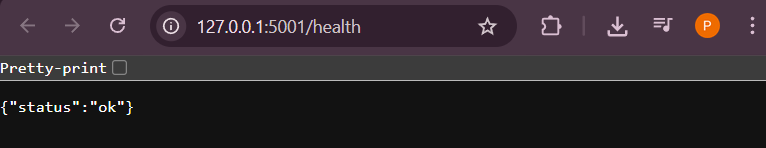
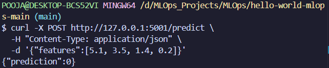
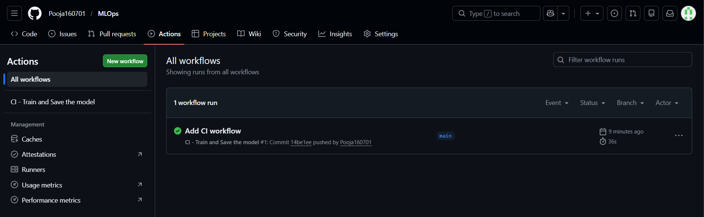

# 🚀 Hello World MLOps — End-to-End ML Pipeline with CI/CD

An end-to-end Machine Learning Operations (MLOps) project that demonstrates how to train, package, serve, and automate deployment of a machine learning model using modern DevOps practices.

This project trains a classification model on the Iris dataset, exposes it via a REST API, containerizes the service with Docker, and automates training using GitHub Actions CI.

---

## 📌 Features

* ✅ Model training pipeline
* ✅ Model artifact generation
* ✅ REST API for inference (Flask)
* ✅ Command-line inference script
* ✅ Docker containerization
* ✅ Automated CI workflow (GitHub Actions)
* ✅ Health check endpoint
* ✅ Reproducible environment via requirements.txt

---

## 🧠 Problem Statement

Build a production-ready pipeline that demonstrates how machine learning models move from development to deployment in a reliable, automated manner.

---

## 🏗️ Project Architecture

```text
Developer → GitHub Push → CI Pipeline → Model Training → Artifacts → Deployment
```

### Components

* **Training Layer:** `train.py`
* **Inference Layer:** `app.py`, `run_model.py`
* **Artifacts:** Serialized model + metrics
* **Containerization:** Dockerfile
* **Automation:** GitHub Actions workflow

---

## 📂 Project Structure

```text
hello-world-mlops/
│
├── .github/workflows/
│   └── ci.yml              # CI pipeline
│
├── artifacts/              # Generated model & metrics
│   ├── model.pkl
│   └── metrics.json
│
├── app.py                  # Flask API server
├── train.py                # Model training script
├── run_model.py            # CLI inference script
├── requirements.txt        # Dependencies
├── Dockerfile              # Container config
├── README.md
└── .gitignore
```

---

## ⚙️ Installation

### 1️⃣ Clone Repository

```bash
git clone https://github.com/Pooja160701/MLOps.git
cd MLOps
```

---

### 2️⃣ Create Virtual Environment (Recommended)

#### Windows (Git Bash)

```bash
python -m venv venv
source venv/Scripts/activate
```

#### macOS/Linux

```bash
python3 -m venv venv
source venv/bin/activate
```

---

### 3️⃣ Install Dependencies

```bash
pip install -r requirements.txt
```

---

## 🧪 Train the Model

```bash
python train.py
```

This will:

* Train the classifier
* Save the model to `artifacts/model.pkl`
* Save evaluation metrics to `artifacts/metrics.json`

---

## 🔮 Run Inference (CLI)

```bash
python run_model.py --input "[5.1, 3.5, 1.4, 0.2]"
```

### Output Example

```json
{"prediction": [0]}
```

---

## 🌐 Run REST API Server

```bash
python app.py
```

Server runs at:

```
http://127.0.0.1:5001
```

---

## ❤️ Health Check Endpoint

```bash
GET /health
```

Example:

```bash
curl http://127.0.0.1:5001/health
```

Response:

```json
{"status": "ok"}
```

---

## 🔮 Prediction Endpoint

```bash
POST /predict
```

### Example Request

```bash
curl -X POST http://127.0.0.1:5001/predict \
  -H "Content-Type: application/json" \
  -d '{"features":[5.1, 3.5, 1.4, 0.2]}'
```

### Response

```json
{"prediction": 0}
```

---

## 🐳 Docker Usage

### Build Image

```bash
docker build -t mlops-iris .
```

### Run Container

```bash
docker run -p 5001:5001 mlops-iris
```

---

## 🔁 Continuous Integration (GitHub Actions)

The CI pipeline automatically:

1. Runs on push or pull request to `main`
2. Installs dependencies
3. Trains the model
4. Generates artifacts
5. Uploads artifacts for download

### Workflow File

```
.github/workflows/ci.yml
```

---

## 📦 CI Artifacts

After each successful run, GitHub stores:

* Trained model (`model.pkl`)
* Metrics (`metrics.json`)

Accessible via:

👉 GitHub → Actions → Workflow Run → Artifacts

---

## 📊 Dataset

This project uses the classic **Iris dataset**, a multiclass classification problem predicting flower species based on sepal and petal measurements.

Classes:

* 0 → Setosa
* 1 → Versicolor
* 2 → Virginica

---

## 🛠️ Tech Stack

* Python
* Scikit-learn
* Flask
* NumPy
* Joblib
* Docker
* GitHub Actions (CI/CD)

---

## 🔐 Reproducibility

Dependencies are pinned in `requirements.txt`, ensuring consistent builds across environments.

---

## 🚀 Future Improvements

* Model versioning (MLflow)
* Data versioning (DVC)
* Continuous deployment to cloud
* Monitoring & logging
* Kubernetes deployment
* API documentation (Swagger/OpenAPI)
* Performance benchmarking

---

## 👩‍💻 Author

**Pooja**

---

## 📜 License

This project is for educational and demonstration purposes.

---